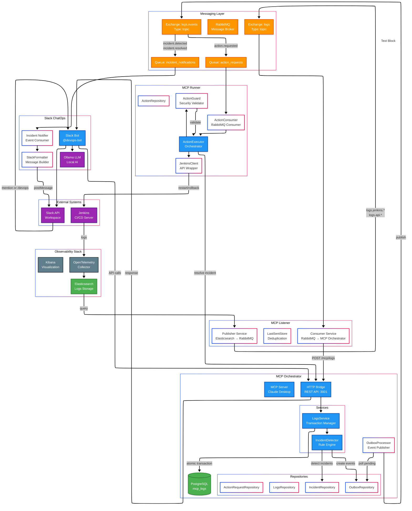
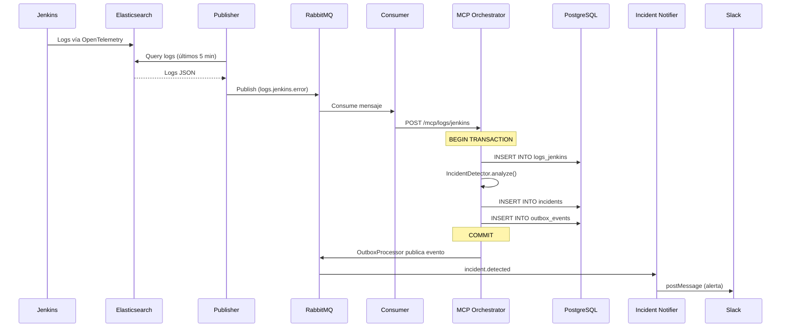
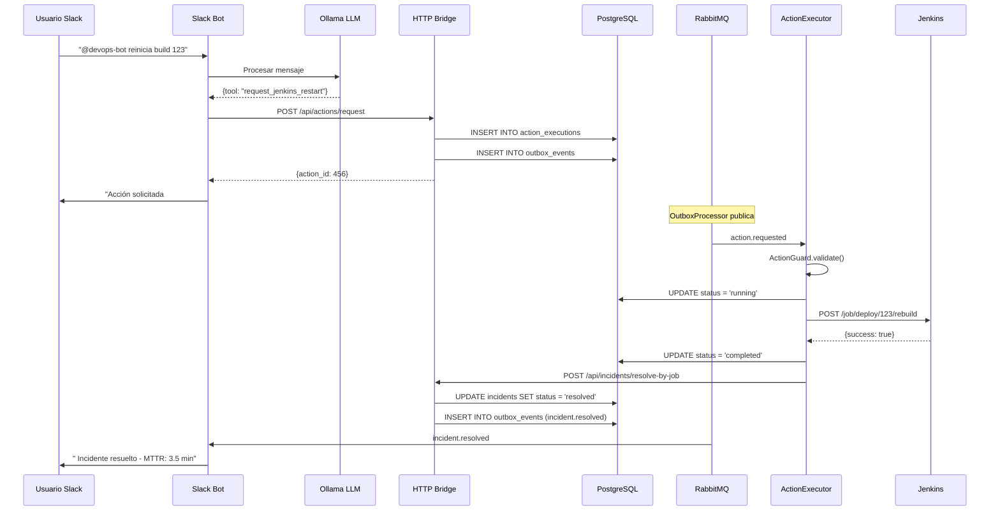
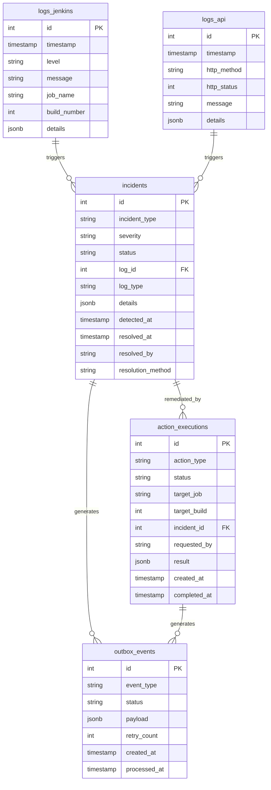

# Arquitectura del Sistema MCP Runbooks

## Resumen Ejecutivo

Sistema de **monitoreo proactivo y remediación automatizada** para infraestructura DevOps que integra logs de Jenkins y APIs, detecta incidentes en tiempo real, y ejecuta acciones correctivas automáticas mediante runbooks.

**Stack Tecnológico Principal:**
- **Backend:** TypeScript + Node.js
- **Base de Datos:** PostgreSQL
- **Mensajería:** RabbitMQ (AMQP)
- **Observabilidad:** Elasticsearch + Kibana + OpenTelemetry
- **Integración:** Slack (ChatOps) + Ollama (LLM local)
- **Automatización:** Jenkins API

---

## Diagrama de Arquitectura General



---

## Componentes Principales

### 1️. **MCP Listener** - Ingesta de Logs

**Responsabilidad:** Puente entre Elasticsearch y el sistema MCP

**Componentes:**
- **Publisher Service:** Consulta logs de Elasticsearch y los publica a RabbitMQ
- **Consumer Service:** Consume logs de RabbitMQ y los envía al MCP Orchestrator
- **LastSentStore:** Sistema de deduplicación basado en timestamps

**Flujo de Datos:**
```
Elasticsearch → Publisher → RabbitMQ (logs.jenkins.*, logs.api.*) → Consumer → MCP Orchestrator
```

**Tecnologías:**
- `@elastic/elasticsearch` - Cliente de Elasticsearch
- `amqplib` - Cliente de RabbitMQ
- Routing keys dinámicas por nivel de log

---

### 2. **MCP Orchestrator** - Cerebro del Sistema

**Responsabilidad:** Detección de incidentes, gestión de eventos, y coordinación

**Arquitectura de Capas:**

#### **Capa de Presentación**
- **HTTP Bridge** (`:3001`) - REST API para Ollama y servicios externos
- **MCP Server** - Protocolo MCP para Claude Desktop (stdio)

#### **Capa de Servicios**
- **LogsService:** Gestor de transacciones atómicas para inserción de logs + detección de incidentes
- **IncidentDetector:** Motor de reglas para detección de incidentes en tiempo real
- **OutboxProcessor:** Procesador de eventos pendientes con patrón Outbox

#### **Capa de Datos**
- **LogsRepository:** CRUD de logs de Jenkins y API
- **IncidentRepository:** Gestión de incidentes (CRUD, estados, MTTR)
- **ActionRequestRepository:** Solicitudes de acciones correctivas
- **OutboxRepository:** Eventos pendientes de publicación

**Base de Datos PostgreSQL:**
```sql
-- Tablas principales
logs_jenkins          -- Logs de Jenkins
logs_api              -- Logs de API
incidents             -- Incidentes detectados
action_executions     -- Acciones ejecutadas
outbox_events         -- Eventos pendientes (Outbox Pattern)
```

**Flujo Transaccional (ACID):**
```
1. Recibir logs vía HTTP POST
2. BEGIN TRANSACTION
3. Insertar logs en DB
4. Detectar incidentes (IncidentDetector)
5. Crear incidentes en DB
6. Crear eventos en outbox_events
7. COMMIT TRANSACTION
8. OutboxProcessor publica eventos a RabbitMQ
```

---

### 3. **MCP Runner** - Ejecutor de Acciones

**Responsabilidad:** Ejecución segura de acciones correctivas en Jenkins

**Componentes:**

#### **ActionConsumer**
- Consume mensajes de la cola `action_requests`
- Delega ejecución al `ActionExecutor`

#### **ActionExecutor**
- Orquesta el flujo de ejecución de acciones
- Valida seguridad con `ActionGuard`
- Ejecuta acciones vía `JenkinsClient`
- Resuelve incidentes relacionados tras éxito

#### **ActionGuard** (Security Layer)
- Valida jobs permitidos (whitelist)
- Verifica horarios de negocio
- Controla concurrencia máxima
- Modo Dry Run para testing

#### **JenkinsClient**
- Wrapper de la API de Jenkins
- Operaciones: `restartBuild`, `rollbackToBuild`, `stopBuild`
- Health checks y manejo de errores

**Flujo de Ejecución:**
```
1. Consumir acción de RabbitMQ
2. Validar seguridad (ActionGuard)
3. Marcar como RUNNING en DB
4. Ejecutar acción en Jenkins
5. Marcar como COMPLETED/FAILED
6. Resolver incidente relacionado (POST /api/incidents/resolve-by-job)
```

---

### 4. **Slack ChatOps** - Interfaz de Usuario

**Responsabilidad:** Notificaciones y control conversacional

#### **Incident Notifier**
- Consume eventos `incident.detected` e `incident.resolved`
- Formatea mensajes con `SlackFormatter`
- Publica notificaciones a canales de Slack
- Incluye MTTR en notificaciones de resolución

#### **Slack Bot** (`@devops-bot`)
- Escucha menciones y comando `/devops`
- Integra Ollama (LLM local) para procesamiento de lenguaje natural
- Traduce intenciones a llamadas API del MCP Bridge
- Ejecuta herramientas: `get_active_incidents`, `request_jenkins_restart`, etc.

**Ejemplo de Interacción:**
```
Usuario: "@devops-bot reinicia el build 123 del job deploy-prod"
   ↓
Ollama: {tool: "request_jenkins_restart", params: {job: "deploy-prod", build: 123}}
   ↓
Slack Bot → HTTP Bridge → MCP Orchestrator → RabbitMQ → MCP Runner → Jenkins
   ↓
Slack Bot: " Build reiniciado exitosamente"
```

---

## Patrones de Diseño Implementados

### 1. **Repository Pattern** 
**Ubicación:** `mcp_orchestrator/src/db/*Repository.ts`, `mcp_runner/src/db/ActionRepository.ts`

**Propósito:** Abstracción de la capa de datos

**Implementación:**
```typescript
class IncidentRepository {
  constructor(private pool: Pool) {}
  
  async create(incident: DetectedIncident): Promise<number>
  async getById(id: number): Promise<Incident | null>
  async getActiveIncidents(): Promise<Incident[]>
  async markAsResolved(id: number, resolvedBy: string): Promise<void>
}
```

**Beneficios:**
- Separación de lógica de negocio y acceso a datos
- Facilita testing con mocks
- Centraliza queries SQL

---

### 2. **Outbox Pattern** 
**Ubicación:** `mcp_orchestrator/src/outbox/OutboxProcessor.ts`

**Propósito:** Garantizar consistencia eventual entre DB y mensajería

**Flujo:**
```
1. Transacción atómica: INSERT logs + INSERT incidents + INSERT outbox_events
2. COMMIT
3. OutboxProcessor (polling cada 5s):
   - SELECT * FROM outbox_events WHERE status = 'pending'
   - Publicar a RabbitMQ
   - UPDATE status = 'completed'
```

**Ventajas:**
- No se pierden eventos si RabbitMQ está caído
- Garantía de entrega (at-least-once)
- Retry automático con backoff exponencial

---

### 3. **Strategy Pattern** 
**Ubicación:** `mcp_orchestrator/src/services/IncidentDetector.ts`

**Propósito:** Detección de incidentes basada en reglas configurables

**Implementación:**
```typescript
interface IncidentRule {
  name: string
  type: 'jenkins' | 'api'
  severity: IncidentSeverity
  condition: (log: any) => boolean
  runbook: string
}

const INCIDENT_RULES: IncidentRule[] = [
  {
    name: 'jenkins_build_failure',
    type: 'jenkins',
    severity: 'high',
    condition: (log) => log.level === 'ERROR' && log.message.includes('BUILD FAILED'),
    runbook: 'https://wiki/runbooks/jenkins-build-failure'
  }
]
```

**Beneficios:**
- Reglas extensibles sin modificar código
- Fácil agregar nuevos tipos de incidentes
- Testeable unitariamente

---

### 4. **Observer Pattern** 
**Ubicación:** RabbitMQ + Consumers

**Propósito:** Desacoplamiento entre productores y consumidores de eventos

**Implementación:**
```
Publisher (OutboxProcessor) → RabbitMQ Exchange → Multiple Consumers
                                    ↓
                        ┌───────────┴───────────┐
                        ↓                       ↓
                ActionConsumer          IncidentNotifier
```

**Beneficios:**
- Escalabilidad horizontal (múltiples consumers)
- Tolerancia a fallos (queues persistentes)
- Desacoplamiento temporal

---

### 5. **Singleton Pattern**
**Ubicación:** `mcp_orchestrator/src/config/Config.ts`, `mcp_runner/src/config/Config.ts`

**Propósito:** Configuración global única

**Implementación:**
```typescript
class Config {
  private static instance: Config
  
  static getInstance(): Config {
    if (!Config.instance) {
      Config.instance = new Config()
    }
    return Config.instance
  }
}
```

---

### 6. **Facade Pattern** 
**Ubicación:** `mcp_orchestrator/src/http-bridge.ts`, `mcp_runner/src/services/JenkinsClient.ts`

**Propósito:** Simplificar interfaces complejas

**Ejemplo - HTTP Bridge:**
```typescript
// Simplifica el acceso a múltiples servicios
app.post('/api/incidents/:id/acknowledge', async (req, res) => {
  const result = await mcpHandlers.handleAcknowledgeIncident({
    incident_id: parseInt(req.params.id),
    user: req.body.user
  })
  res.json({ success: true, data: result })
})
```

**Ejemplo - JenkinsClient:**
```typescript
// Abstrae la complejidad de la API de Jenkins
class JenkinsClient {
  async restartBuild(jobName: string, buildNumber: number): Promise<ActionResult> {
    // Maneja autenticación, headers, retries, etc.
  }
}
```

---

## Flujos de Datos Principales

### Flujo 1: Detección de Incidentes



---

### Flujo 2: Remediación Automatizada



---

##  Esquema de Base de Datos



---

##  Seguridad y Validaciones

### ActionGuard - Validaciones de Seguridad

```typescript
class ActionGuard {
  validate(action: ActionExecution): ValidationResult {
    if (!config.security.allowedJobs.includes(action.target_job)) {
      return { allowed: false, reason: 'Job no autorizado' }
    }
    
    if (config.security.businessHoursOnly && !isBusinessHours()) {
      return { allowed: false, reason: 'Fuera de horario' }
    }
    
    if (runningActions >= config.security.maxConcurrentActions) {
      return { allowed: false, reason: 'Límite de concurrencia' }
    }
    
    return { allowed: true }
  }
}
```

**Configuración de Seguridad:**
- `allowedJobs`: Lista blanca de jobs de Jenkins
- `businessHoursOnly`: Restricción de horario (9am-6pm)
- `maxConcurrentActions`: Máximo de acciones simultáneas
- `dryRun`: Modo simulación para testing

---

##  Tecnologías y Dependencias

### MCP Orchestrator
```json
{
  "dependencies": {
    "@modelcontextprotocol/sdk": "1.17.4",  // MCP Protocol
    "express": "^5.1.0",                     // HTTP Server
    "pg": "^8.16.3",                         // PostgreSQL
    "amqplib": "^0.10.4"                     // RabbitMQ
  }
}
```

### MCP Runner
```json
{
  "dependencies": {
    "pg": "^8.16.3",        // PostgreSQL
    "dotenv": "^17.2.3",    // Environment vars
    "fetch": "^1.1.0"       // HTTP client
  }
}
```

### MCP Listener
```json
{
  "dependencies": {
    "@elastic/elasticsearch": "^8.19.1",  // Elasticsearch client
    "amqplib": "^0.10.9"                  // RabbitMQ
  }
}
```

### Slack ChatOps
```json
{
  "dependencies": {
    "@slack/bolt": "^3.17.1",      // Slack Bot framework
    "@slack/web-api": "^7.0.0",    // Slack API
    "amqplib": "^0.10.3",          // RabbitMQ
    "axios": "^1.6.5"              // HTTP client (Ollama)
  }
}
```

---

##  Métricas y Observabilidad

### Métricas Clave

**Incidents:**
- Total de incidentes detectados
- Incidentes por severidad (critical, high, medium, low)
- MTTR (Mean Time To Resolution)
- Tasa de resolución automática

**Actions:**
- Total de acciones ejecutadas
- Tasa de éxito/fallo
- Duración promedio de ejecución
- Acciones rechazadas por seguridad

**Outbox:**
- Eventos pendientes
- Eventos completados
- Eventos fallidos
- Tasa de éxito de publicación

### Logs Estructurados

Todos los servicios usan logging estructurado con niveles:
- `ERROR` - Errores críticos
- `WARN` - Advertencias
- `INFO` - Información general
- `DEBUG` - Debugging detallado

---

##  Configuración y Deployment

### Variables de Entorno

**MCP Orchestrator:**
```env
DATABASE_HOST=localhost
DATABASE_PORT=5432
DATABASE_NAME=mcp_logs
DATABASE_USER=postgres
DATABASE_PASSWORD=postgres
RABBITMQ_URL=amqp://localhost:5672
HTTP_BRIDGE_PORT=3001
```

**MCP Runner:**
```env
DATABASE_HOST=localhost
JENKINS_URL=http://jenkins:8080
JENKINS_USERNAME=admin
JENKINS_API_TOKEN=***
RABBITMQ_URL=amqp://localhost:5672
DRY_RUN=false
```

**Slack ChatOps:**
```env
SLACK_BOT_TOKEN=xoxb-***
SLACK_SIGNING_SECRET=***
SLACK_APP_TOKEN=xapp-***
OLLAMA_URL=http://localhost:11434
OLLAMA_MODEL=llama3.2
MCP_BRIDGE_URL=http://localhost:3001
```

### Docker Compose

**Infraestructura:**
- Elasticsearch (`:9200`)
- Kibana (`:5601`)
- RabbitMQ (`:5672`, `:15672`)
- PostgreSQL (`:5432`)
- OpenTelemetry Collector (`:4317`, `:4318`)

---

## Conclusiones

### Fortalezas del Sistema

 **Arquitectura Desacoplada:** Componentes independientes comunicados vía mensajería  
 **Transacciones Atómicas:** Outbox Pattern garantiza consistencia  
 **Escalabilidad Horizontal:** Múltiples consumers pueden procesar eventos  
 **Seguridad Robusta:** Validaciones en múltiples capas (ActionGuard)  
 **Observabilidad Completa:** Logs estructurados + métricas + trazas  
 **Interfaz Conversacional:** ChatOps con LLM para democratizar operaciones  

### Patrones de Diseño Destacados

1. **Repository Pattern** - Abstracción de datos
2. **Outbox Pattern** - Consistencia eventual
3. **Strategy Pattern** - Reglas de detección extensibles
4. **Observer Pattern** - Eventos desacoplados
5. **Singleton Pattern** - Configuración global
6. **Facade Pattern** - Simplificación de APIs

### Tecnologías Clave

- **TypeScript** - Type safety y mejor DX
- **PostgreSQL** - ACID transactions
- **RabbitMQ** - Mensajería confiable
- **Elasticsearch** - Búsqueda y análisis de logs
- **Slack + Ollama** - ChatOps con IA local

---

##  Referencias

- [Model Context Protocol (MCP)](https://modelcontextprotocol.io/)
- [Outbox Pattern](https://microservices.io/patterns/data/transactional-outbox.html)
- [Repository Pattern](https://martinfowler.com/eaaCatalog/repository.html)
- [RabbitMQ Patterns](https://www.rabbitmq.com/getstarted.html)
- [Slack Bolt Framework](https://slack.dev/bolt-js/)

---
